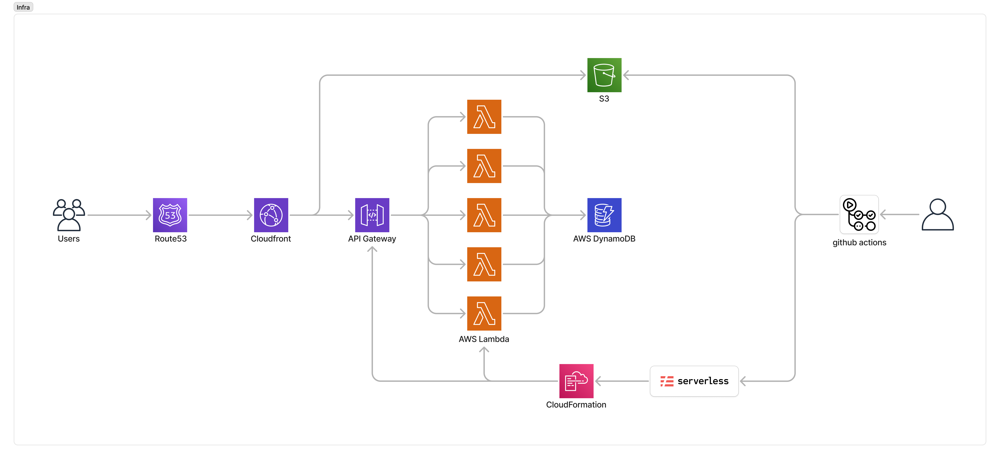

# Infra


# DynamoDB 테이블 스키마

아래는 **주문접수 애플리케이션**에서 사용되는 **5개 테이블**의 스키마 정보를 마크다운 표 형식으로 정리한 것입니다.

---

## 1. ProductsTable

| **Attribute** | **Type** | **Description**                      |
|---------------|----------|--------------------------------------|
| `productId`   | String   | **(PK)** 상품 고유 ID                |
| `sellerId`    | String   | 상품 등록자(판매자) ID (GSI용)       |
| `name`        | String   | 상품명                               |
| `description` | String   | 상품 설명                             |
| `imageUrl`    | String   | 상품 이미지 URL                       |
| `basePrice`   | Number   | 기본 가격                             |
| `stock`       | Number   | 전체 재고 수량                        |

- **Primary Key**: `productId` (Partition Key)
- **Global Secondary Index**: `sellerId-index` (판매자별 상품 조회)

---

## 2. EventsTable

| **Attribute**      | **Type** | **Description**                 |
|--------------------|----------|---------------------------------|
| `eventId`          | String   | **(PK)** 이벤트 고유 ID              |
| `eventKey`         | String   | 이벤트 고유 KEY (URL용)               |
| `sellerId`         | String   | 이벤트 생성자(판매자) ID (GSI용)          |
| `eventFullManage`  | **json** | 이벤트 정보 전체                       |
| `.eventId`         | String   | \> 이벤트 제목                       |
| `.title`           | String   | \> 이벤트 제목                       |
| `.description`     | String   | \> 이벤트 설명                       |
| `.startTime`       | String   | \> 이벤트 시작 시간 (ISO 8601)         |
| `.endTime`         | String   | \> 이벤트 종료 시간 (ISO 8601)         |
| `.payAccountOwner` | String   | 이벤트 종료 시간 (ISO 8601)            |
| `.payAccount`      | String   | 이벤트 종료 시간 (ISO 8601)            |
| `.status`          | String   | `PENDING`, `ACTIVE`, `CLOSED` 등 |
| `.items`           | **List** | \> 판매대상 상품정보 전체                 |
| \>>`.productId`    | String   | \>> 상품ID                        |
| \>>`.productName`  | String   | \>> 상품명                         |
| \>>`.productDesc`  | String   | \>> 상품설명                        |
| \>>`.eventPrice`   | Number   | \>> 판매가격 (event한정)              |
| \>>`.stock`        | Number   | \>> 판매재고 (event한정)              |

- **Primary Key**: `eventId`
- **Global Secondary Index**: `sellerId-index` (판매자별 이벤트 조회)

---

~~## 3. EventItemsTable~~ **_[event별 판매상품은 events의 items 로 편입]_**

| **Attribute**     | **Type** | **Description**                                |
|-------------------|----------|------------------------------------------------|
| ~~`eventId`~~     | String   | **(PK)** 이벤트 고유 ID                        |
| ~~`productId`~~   | String   | **(SK)** 상품 고유 ID                          |
| ~~`eventPrice`~~  | Number   | 이벤트에서 적용되는 가격                       |
| ~~`stock`~~       | Number   | 이벤트 단위 재고                               |
| ~~`description`~~ | String   | (선택) 이벤트 내 상품에 대한 상세 설명         |
| ~~`imageUrl`~~    | String   | (선택) 이벤트 내 상품 이미지를 별도로 저장 시  |

- **Primary Key**: `(eventId, productId)`
    - `eventId`: Partition Key
    - `productId`: Sort Key
- (선택) **Global Secondary Index**: `productId-index` → 상품별 조회

---

## 4. OrdersTable

| **Attribute**     | **Type** | **Description**                         |
|-------------------|----------|-----------------------------------------|
| `orderId`         | String   | **(PK)** 주문 고유 ID                       |
| `eventId`         | String   | 주문이 발생한 이벤트 ID                          |
| `buyerId`         | String   | 구매자 ID (GSI용)                           |
| `orderItems`      | List     | 주문 상품 목록                                |
| `.productId`      | String   | \> productId                            |
| `.name`           | String   | \> 제품명                                  |
| `.price`          | String   | \> 단가                                   |
| `.quantity`       | String   | \> 수량                                   |
| `.amount`         | String   | \> 금액                                   |
| `totalAmount`     | Number   | 총 주문 금액                                 |
| `orderTime`       | String   | 주문 시간 (ISO 8601)                        |
| `orderNo`         | String   | 주문 확인용 거래번호                             |
| `status`          | String   | `PENDING`, `CONFIRMED`, `DISPATCHED`, 등 |
| `buyerName`       | String   | 구매자(수령인) 이름                             |
| `phone`           | String   | 구매자(수령인) 연락처                            |
| `postcode`        | String   | 우편번호                                    |
| `addressEtc`      | String   | 상세 주소                                   |
| `address`         | String   | 표시용 전체 주소                               |
| `isPaid`          | Boolean  | 입금확인여부                                  |
| `isShipped`       | Boolean  | 택배발송여부                                  |
| `trackingNo`      | String   | 택배송장번호                                  |
| `payname`         | Boolean  | 입금자명                                    |
| `payAccount`      | String   | 입금은행계좌번호 (event 상속)                     |
| `payAccountOwner` | String   | 예금주 (event 상속)                          |

- **Primary Key**: `orderId`
- **Global Secondary Index**: `buyerId-index` (구매자별 주문 조회)

---

## 5. UsersTable

| **Attribute** | **Type** | **Description**                    |
|---------------|----------|------------------------------------|
| `userId`      | String   | **(PK)** 사용자 고유 ID            |
| `name`        | String   | 사용자 이름                         |
| `email`       | String   | 이메일                             |
| `role`        | String   | `BUYER`, `SELLER` 등 사용자 역할    |

- **Primary Key**: `userId`

---

---
## local 환경 테스트
### - lambda
1. **aws-cli 환경 선택**
  - intelliJ 등 aws-tools-kit credentials 선택
  - aws terminal 실행 및 터미널 상단에서 실행환경 확인
  - aws credentials 설정
  - backend 폴더에서 node 실행

```bash 
export AWS_PROFILE=ehrdkb-2
npm run dev               
```


### - frontend(vue)
  - proxy router 설정 : /api 경로를 localhost:3000 으로 연결
  - 
1. **admin 환경**
```bash
  cd ./frontend/admin
  npm run dev
```

---

http://localhost:3000/getEventPage/4c6d53fb-87eb-409c-9b7b-dadb5896973


## 최초 개발환경 설정 (clone project부터)

1) backend 폴더 npm install
2) backend > lambda 폴더 npm install
3) backend 폴더 npm run dev
4) aws cli 환경 설정


- 판매자 기능
1) 판매자(admin) login (카카오 인증)
2) 판매자 정보관리: 사업자등록번호,상호명,연락처,입금은행정보(은행명계좌번호,예금주), 택배사, 결제방법
3) 판매자 event 목록 : event별 주문건수/금액
4) 판매자 상품 관리 (생성,수정)
5) 판매자 event 생성(완료) / 수정(상태변경)
6) 판매자 event별 order 목록 
7) 판매자 event별 order 수정 (상태변경 100%)
- 구매자
1) event 정보보기 (80%)
2) order생성 
3) order확인 / 취소

